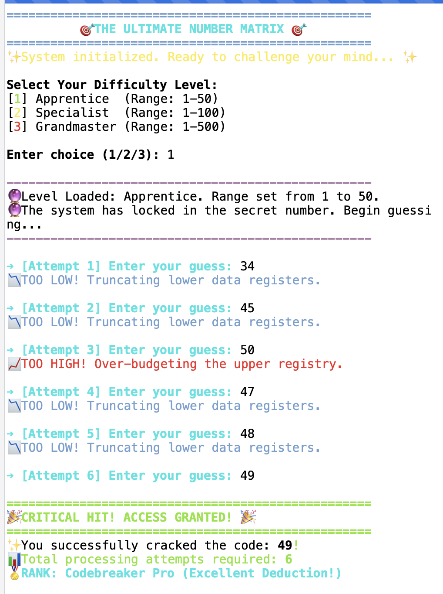

# 🎯 The Ultimate Number Matrix

An arcade-style terminal number guessing game built with Python. Features cinematic animations, ANSI color feedback, multi-tier difficulty, and performance rankings.



## 🕹️ Features
- Typewriter animation UI
- 3 difficulty tiers: Apprentice (1–50), Specialist (1–100), Grandmaster (1–500)
- ANSI color feedback (Too High / Too Low / Win)
- Performance rank based on attempts
- Quit anytime by typing `quit`

## 🛠️ Requirements
- Python 3.x
- A terminal that supports ANSI colors (VS Code, iTerm2, Windows Terminal)

## 🚀 How to Run

```bash
git clone https://github.com/akshay06-max/Numbers-Guessing-Game.git
cd Numbers-Guessing-Game
python main.py
```

## 📊 Performance Ranks
| Rank | Attempts |
|------|----------|
| 🏅 Quantum Intelligence | ≤ 4 |
| 🏅 Codebreaker Pro | ≤ 8 |
| 🏅 Cyber Navigator | 9+ |
